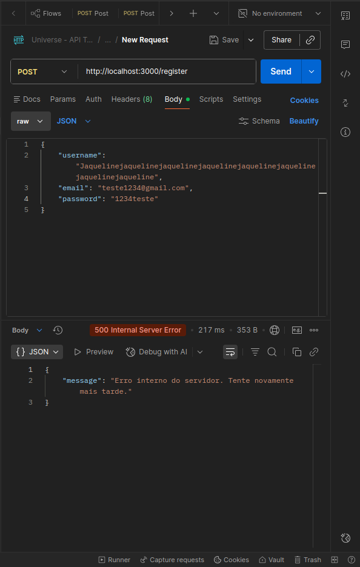
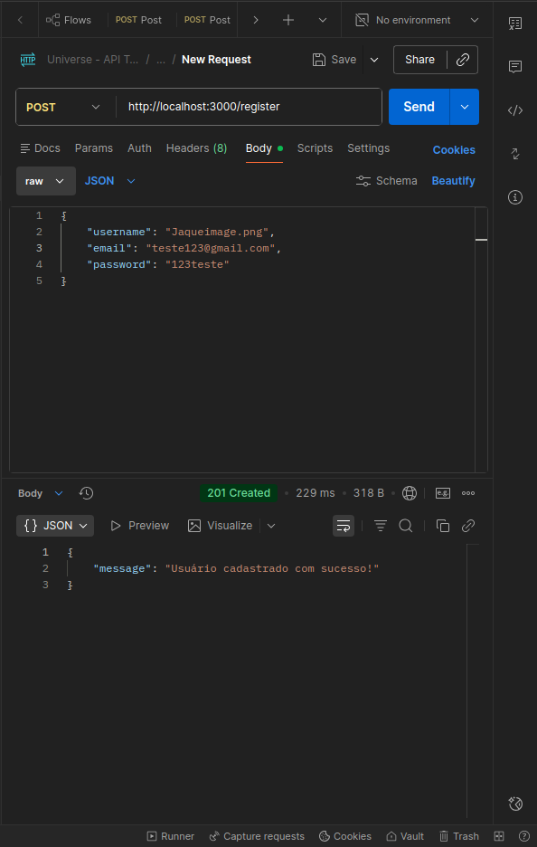

# 🧪 Relatório de Bug Report: Módulo de Cadastro (Universe)

## 🎯 Objetivo: Validar limite de caracteres, formatação de email e integridade do username para garantir que os dados salvos no BD sejam seguros.

### 1. [Cadastro] - Erro de 500 ao enviar username > 50 caracteres

- **Severidade:** Crítico (O servidor cai)
- **Prioridade:** Alta
- **Ambiente:** Postman
- **Descrição:** O campo username só aceita nomes com limite de 50 caracteres, e não exibe uma mensagem de erro.
- **Passos para Reproduzir:** 1. Selecionar o método Post com o caminho: “http://localhost:3000/register” 2. Selecionar no Body username com 51 caracteres 3. Clicar em “Send”
- **Resultado Esperado:** Mensagem: “Limite de caracteres atingido!” com status 400 Bad Request.
- **Resultado Obtido:** A mensagem “Erro interno no servidor. Tente novamente mais tarde” com status 500.
- **Log do Erro (Stack Trace):**  ```
Erro ao inserir dados no banco: error: value too long for type character varying(50)
at /home/jaqueline-gotardi/Área de trabalho/projeto-universe-oficial/backend/server.js:191:24
code: '22001',
severity: 'ERROR',
file: 'varchar.c',
line: '638' ```

- **Evidências:**  

### 2. [Cadastro] – Falha na validação do formato do Email (aceita apenas domínio)

- **Severidade:** Alta (pois irá impedir uma futura recuperação de senha, caso seja preciso)
- **Prioridade:** Alta
- **Ambiente:** Postman
- **Descrição:** O e-mail está sendo aceito apenas como “@gmail.com”
- **Passos para Reproduzir:** 1. Definir o método como Post. 2. Inserir “http://localhost:3000/register”, 3. Ir no body e digitar no “e-mail”: “@gmail.com”, 4. Clicar em “Send”
- **Resultado Esperado:** Um aviso: “Defina um e-mail válido”, com status 422 (formato inválido de email)
- **Resultado Obtido:** A mensagem: “Usuário cadastrado com sucesso”, com status 201.
- **Response (201 Created):** ```{ "message": "Usuário cadastrado com sucesso!" }```

- **Evidências:**  

### 3. [Cadastro] – Username sendo aceito como formato de imagem e caracteres especiais

- **Severidade:** Menor
- **Prioridade:** Média
- **Ambiente:** Postman
- **Descrição:** O username está sendo aceito como um formato de foto, exemplo: “Jaque.png/jpge”
- **Passos para Reproduzir:** 1. Selecionar o método Post, 2. Inserir o caminho “http://localhost:3000/register”, 3. Escrever em username: “Jaque.png”, 4. Clicar em “Send”
- **Resultado Esperado:** Uma mensagem: “Só aceitamos nomes válidos” e validar apenas nomes alfanúmericos.
- **Resultado Obtido:** A mensagem ”Usuário cadastrado com sucesso”, com status 201.
- **Response (201 Created):** ```{ "message": "Usuário cadastrado com sucesso!" }```

- **Evidências:**  
  