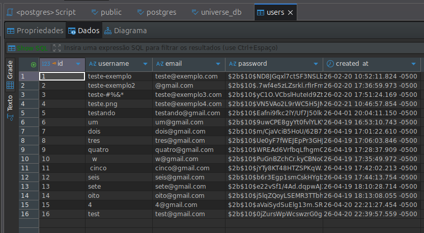
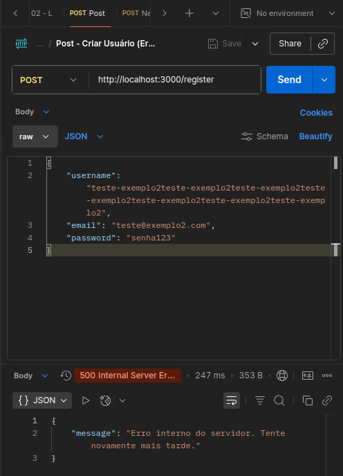
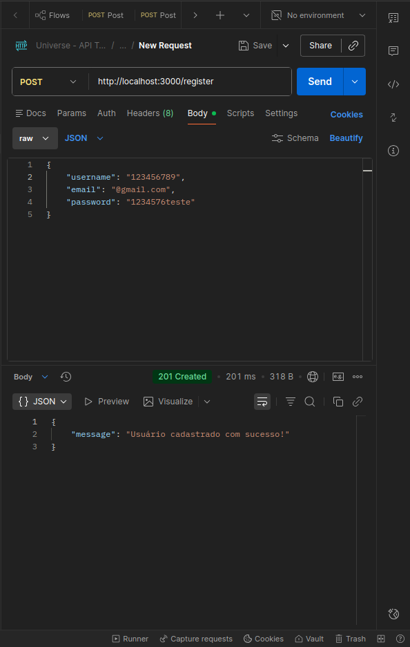
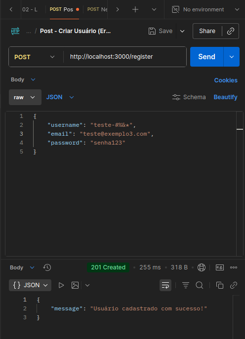
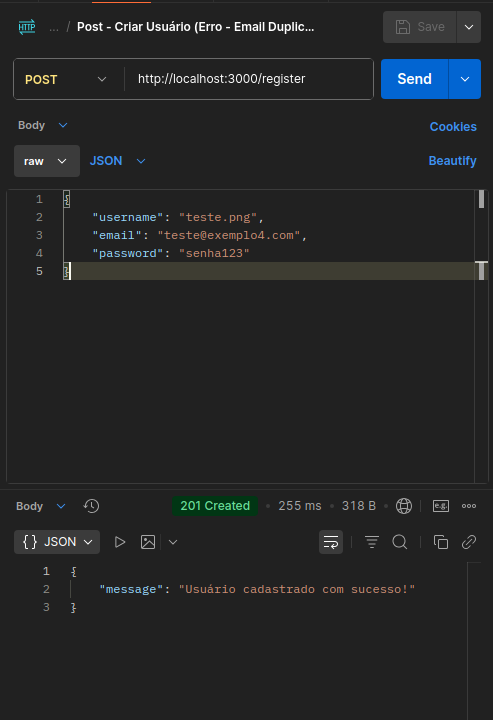

## 🧭 Navegação Rápida
- [✅ Casos de Teste (Sucesso)](#ct-01---validar-cadastro-de-um-usuário-novo)
- [🗄️ Validação de Banco de Dados](#️-validação-de-persistência-sql)
- [☄️ Relatório de Bugs (Falhas)](#-relatório-de-bug-report-módulo-de-cadastro-universe)

# 🧪 Relatório de Testes: Módulo de Autenticação (Universe)

## 🎯 Objetivo
Validar os fluxos de criação de conta e autenticação para garantir a integridade e segurança do acesso ao sistema.

## 🛠️ Tecnologias e Ferramentas
- **Ferramenta:** Postman
- **Banco de Dados:** DBeaver para validação SQL
- **Documentação:** Markdown
- **Ambiente:** Localhost:3000

## 🚀 Metodologia
- **Nível de Teste:** Integração (Backend + Banco de dados)
- **Tipo de Teste:** Funcional
- **Técnica:** Caixa Preta

---

### CT-01 - Validar cadastro de um usuário novo 
- **Descrição:** Verificar se o sistema permite a criação de um novo cadastro único.
- **Pré-condições:** Servidor Backend deve estar em execução e banco de dados conectado. 
- **Dados de teste (exemplo):** 
          ```
              { 
                "username": "teste-exemplo",
                 "email": "teste@exemplo.com",
                  "password": "senha123"
                  } ```
- **Passos:** 1. Realizar a requisição POST no endpoint /register,
              2. No corpo (body) da requisição, enviar Json com dados válidos (conforme o exemplo acima). 
- **Resultado Esperado:** 1. Status Code: 201 Created,
                          2. Mensagem: "Usuário cadastrado com sucesso!".
                          3. O registro deve constar no banco de dados.
- **Resultado Obtido:** Conforme o esperado, um novo cadastro foi inserido no Banco de Dados.

- **Evidência:**  

### CT-02 - Validar cadastro de usuário com credenciais duplicadas 
- **Descrição:** Validar restrição de unicidade para username e e-mail já existentes.
- **Pré-condições:** Servidor Backend deve estar em execução e banco de dados conectados. 
- **Passos:** 1. Repetir a requisição POST em /register com os mesmos dados de teste do CT-01.
- **Resultado Esperado:** Status 409 (conflict), com a mensagem: "Usuário ou email já cadastrado!".

- **Resultado Obtido:** Usuário não foi cadastrado, retornando erro de conflito com dados já existentes.

- **Evidência:**  


### CT-03 - Autenticação de usuário com credenciais válidas
- **Descrição:** Logar com os dados de um cadastro já criado e validar geração de Token.
- **Pré-condições:** Servidor Backend deve estar em execução e banco de dados conectados. 
- **Passos:** 1. Realizar requisição POST em /login
              2. Enviar e-mail e password cadastrado no CT-01
- **Resultado Esperado:** Status 200, com a mensagem: "Login bem-sucedido!" e um Token de acesso deve ser gerado no corpo da resposta.
- **Resultado Obtido:** Login autorizado e Token gerado com sucesso.
- **Evidência:**  

### CT-04 - Validar login com senha incorreta
- **Descrição:** Verificar bloqueio de acesso para senha divergente da cadastrada.
- **Pré-condições:** Servidor Backend deve estar em execução e banco de dados conectados. 
- **Passos:** 1. Realizar a requisição POST em /login
              2. Enviar e-mail válido e password inválido.
- **Resultado Esperado:** Status 401, com a mensagem: "Senha inválida!" e o Token não deve ser gerado.
- **Resultado Obtido:** O usuário foi barrado com status 401.

- **Evidência:**  

### CT-05 - Validar alteração com sucesso (Senha atual correta + Nova senha forte).
- **Descrição:** Verificar se a nova senha digitada cumpre os requisitos obrigatórios para uma senha forte.
- **Pré-condições:** Servidor Backend deve estar em execução.
- **Passos:** 1. Realizar a requisição POST em changePassword/.
              2. Enviar senha atual e nova senha forte.
- **Resultado Esperado:** Status 200, com a mensagem: "Senha alterada com sucesso!"
- **Resultado Obtido:** Nova senha cumpriu os requisitos de segurança.

### CT-06 - Impedir alteração com Senha Atual incorreta
- **Descrição:** Verificar se o campo de senha atual aceita senhas incorretas (que não foram cadastradas)
- **Pré-condições:** Servidor Backend deve estar em execução.
- **Passos:** 1. Realizar a requisição POST em changePassword/. 2. Enviar senha errada no campo senha atual e uma nova senha.
- **Resultado Esperado:** Status 401 (Unauthorized) ou 400. Mensagem informando que a senha atual não confere.
- **Resultado Obtido:** Usuário não pode trocar a senha, pois digitou a senha atual errada.

### CT-07 - Impedir que a Nova Senha seja igual à Senha Atual 
- **Descrição:** Verificar se a nova senha não é igual a senha atual.
- **Pré-condições:** Servidor Backend deve estar em execução.
- **Passos:** Enviar nova senha que, após a limpeza de espaços, seja idêntica à senha atual.
- **Resultado Esperado:** Bloqueio do envio e status 400, com a mensagem: "A nova senha não pode ser igual à senha atual!".
- **Resultado Obtido:** Nova senha foi bloquada, e uma mensagem de alerta foi exibida.


## 🗄️ Validação de Persistência (SQL)
- **Processo:** Após o resultado obtido nos casos de teste(CT-01, CT-02, CT-03, CT-04), foi realizada uma consulta no banco de dados para garantir o registro dos dados em todos os casos.
- **Ferramenta:** DBeaver.
- **Evidência:** 

> Nota: Os dados visualizados são fictícios, gerados exclusivamente para fins de teste no ambiente de desenvolvimento


<br/>
<br/>

---
<br/>
<br/>


# 🧪 Relatório de Bug Report: Módulo de Cadastro (Universe)
> **Atenção:** Esta seção detalha as falhas encontradas durante a execução dos Casos de Teste acima.

## 🎯 Objetivo: Validar limite de caracteres, formatação de email e integridade do username para garantir que os dados salvos no BD sejam seguros.

### BUG-01: [Cadastro] - Erro de 500 ao enviar username > 50 caracteres

- **Severidade:** Crítico (O servidor cai)
- **Prioridade:** Alta
- **Ambiente:** Postman
- **Descrição:** O campo username só aceita nomes com limite de 50 caracteres, e não exibe uma mensagem de erro.
- **Passos para Reproduzir:** 1. Realizar a requisição POST no endpoint /register, 2. No corpo (body) da requisição, enviar Json com username contendo 51 caracteres, 3. Clicar em “Send”,
- **Resultado Esperado:** Mensagem: “Limite de caracteres atingido!” com status 400 (Bad Request).
- **Resultado Obtido:** A mensagem “Erro interno no servidor. Tente novamente mais tarde” com status 500.
- **Log do Erro (Stack Trace):**  ```
Erro ao inserir dados no banco: error: value too long for type character varying(50)
at /home/jaqueline-gotardi/Área de trabalho/projeto-universe-oficial/backend/server.js:191:24
code: '22001',
severity: 'ERROR',
file: 'varchar.c',
line: '638' ```

- **Evidência:**  

### BUG-02. [Cadastro] – Falha na validação do formato de e-mail (regEx inválida)

- **Severidade:** Alta (pois irá impedir uma futura recuperação de senha, caso seja preciso)
- **Prioridade:** Alta
- **Ambiente:** Postman
- **Descrição:** O sistema permite o cadastro de e-mail contendo apenas o domínio (ex:“@gmail.com”), o que dificulta uma possível recuperação de senha no futuro. 
- **Passos para Reproduzir:** 1. Definir o método como Post no endpoint /register, 2. No corpo (body) da requisição, enviar Json no “e-mail”: “@gmail.com”, 3. Clicar em “Send”
- **Resultado Esperado:** Um aviso: “Defina um e-mail válido”, com status 422 (formato inválido de email)
- **Resultado Obtido:** A mensagem: “Usuário cadastrado com sucesso”, com status 201.
- **Response (201 Created):** ```{ "message": "Usuário cadastrado com sucesso!" }```

- **Evidência:**  

### BUG-03. [Cadastro] – Username sendo aceito com 100% de caracteres especiais

- **Severidade:** Média
- **Prioridade:** Média
- **Ambiente:** Postman
- **Descrição:** O username está sendo aceito com caracteres especiais e símbolos, permitindo "nomes" inválidos ou potencialmente perigosos (scripts).
- **Passos para Reproduzir:** 1. Definir o método como Post no endpoint /register, 2. No corpo (body) da requisição, enviar Json com "username": "teste-#%&*", 3. Clicar em “Send”
- **Resultado Esperado:** O servidor retorna status 400, com a mensagem: “Username deve conter apenas caracteres alfanúmericos!” 
- **Resultado Obtido:** A mensagem ”Usuário cadastrado com sucesso”, com status 201.
- **Response (201 Created):** ```{ "message": "Usuário cadastrado com sucesso!" }```

- **Evidência:**   

### BUG-04. [Cadastro] – Username sendo aceito como extensão de arquivo

- **Severidade:** Baixa
- **Prioridade:** Baixa
- **Ambiente:** Postman
- **Descrição:** O sistema permite que o username contenha extensões de arquivos,(ex: .png, .jpg), o que futuramente pode causar confusão com upload de fotos.
- **Passos para Reproduzir:** 1. Definir o método como Post no endpoint /register, 2. No corpo (body) da requisição, enviar Json com "username": "teste.png", 3. Clicar em “Send”
- **Resultado Esperado:** O servidor retorna status 400, com a mensagem: “Username deve conter apenas caracteres alfanúmericos!” 
- **Resultado Obtido:** A mensagem ”Usuário cadastrado com sucesso”, com status 201.
- **Response (201 Created):** ```{ "message": "Usuário cadastrado com sucesso!" }```

- **Evidência:**   