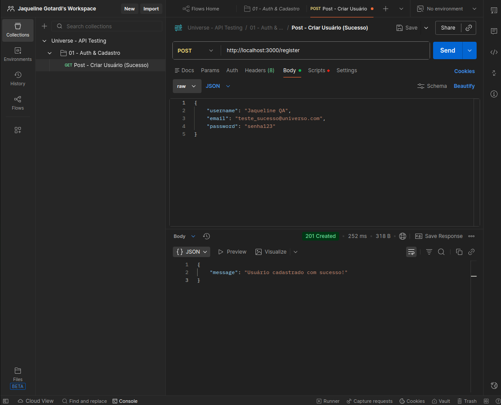
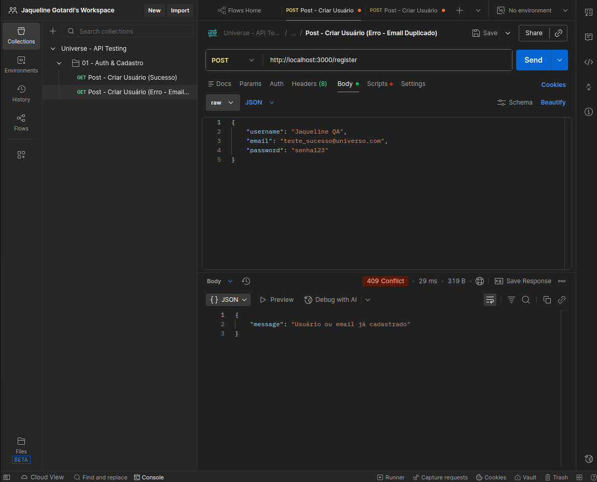
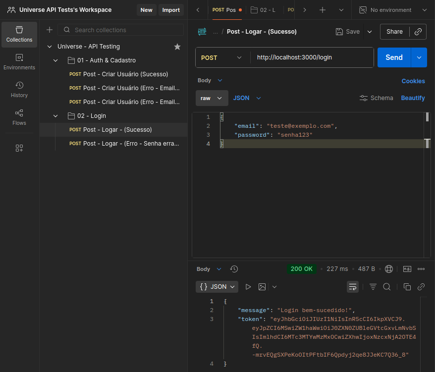
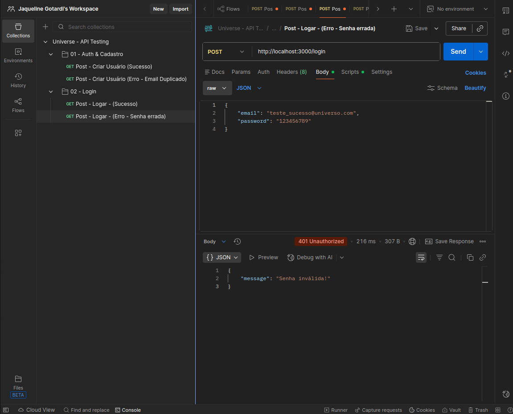
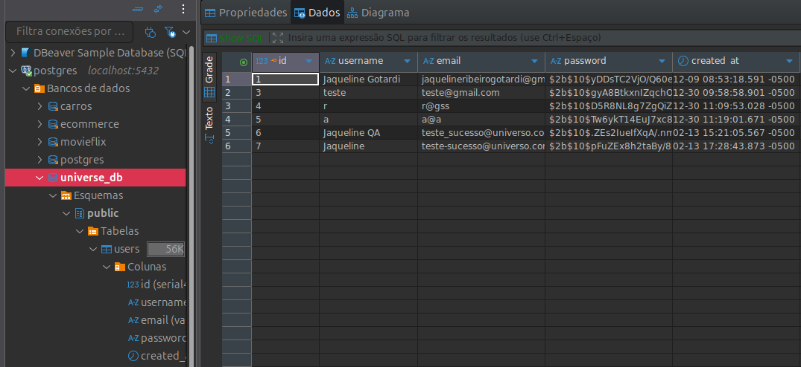

# 🧪 Relatório de Testes: Módulo de Autenticação (Universe)

## 🎯 Objetivo
Validar os fluxos de criação de conta e autentificação para garantir a integridade e segurança do acesso ao sistema.

## 🛠️ Tecnologias e Ferramentas
- **Ferramenta:** Postman
- **Banco de Dados:** DBeaver para validação SQL
- **Documentação:** Markdown
- **Ambiente:** Localhost:3000

## 🚀 Metodologia
- **Nível de Teste:** Integração (Backend + Banco de dados)
- **Tipo de Teste:** Funcional
- **Técnica:** Caixa Preta
- **Abordagem:** Testes de Caminho Feliz e Caminho triste.

---

### CT-01 - Validar cadastro de um usuário novo (Caminho feliz)
- **Descrição:** Criar um cadastro novo no banco de dados.
- **Pré-condições:** Servidor Backend deve está em execução e banco de dados conectados. 
- **Passos:** 1. Inserir a URL http://localhost:3000/register
              2. Definir o método como POST
              3. Enviar no Body em formato de json: 
              ```json 
              { 
                "username": "Jaqueline",
                 "email": "teste-sucesso@universo.com",
                  "password": "senha123"
                  } ```
- **Resultado Esperado:** O sistema deve mostrar status 201, com a mensagem: "Usuário cadastrado com sucesso!".
- **Resultado Obtido:** Um novo cadastro foi inserido no Banco de Dados.
- **Evidência:** 

### CT-02 - Validar cadastro de um usuário já existente (Caminho triste)
- **Descrição:** Criar cadastro com os mesmo dados de um usuário já inserido no Banco de dados.
- **Pré-condições:** Servidor Backend deve está em execução e banco de dados conectados. 
- **Passos:** 1. Inserir a URL http://localhost:3000/register
              2. Definir o método como POST
              3. Enviar no Body em formato de json: 
                 ``` json 
                 { 
                    "username": "Jaqueline",
                    "email": "teste-sucesso@universo.com",
                    "password": "senha123"
                    } ```
- **Resultado Esperado:** O sistema deve retornar status 409, com a mensagem: "Usuário ou email já cadastrado!".
- **Resultado Obtido:** Usuário não é cadastrado, dar erro de conflito com dados já existentes.
- **Evidência:** 


### CT-03 - Validar login com dados já inseridos no Banco de Dados (Caminho feliz)
- **Descrição:** Logar com os dados de um cadastro já criado.
- **Pré-condições:** Servidor Backend deve está em execução e banco de dados conectados. 
- **Passos:** 1. Inserir a URL http://localhost:3000/login
              2. Definir o método como POST
              3. Enviar no Body em formato de json: 
                 ```json 
                 { 
                    "email": "teste-sucesso@universo.com",
                    "password": "senha123"
                    } ```
- **Resultado Esperado:** O sistema deve retornar status 200 e mostrar a mensagem: "Login bem-sucedido!" e um Token de acesso deve ser gerado.
- **Resultado Obtido:** Login feito com sucesso e o Token foi gerado.
- **Evidência:** 

### CT-04 - Validar login com dados não inseridos no Banco de Dados (Caminho triste)
- **Descrição:** Logar com os dados de um cadastro não feito.
- **Pré-condições:** Servidor Backend deve está em execução e banco de dados conectados. 
- **Passos:** 1. Inserir a URL http://localhost:3000/login
              2. Definir o método como POST
              3. Enviar no Body em formato de json: 
                 ```json
                 { 
                    "email": "teste-sucesso@universo.com",
                    "password": "123456789"
                    } ```
- **Resultado Esperado:** O sistema deve retornar status 401, e exibir a mensagem: "Senha inválida!" e o Token não deve ser gerado.
- **Resultado Obtido:** O usuário é barrado com status 401.
- **Evidência:** 

## 🗄️ Validação de Persistência (SQL)
- **Processo:** Após o resultado obtido nos casos de teste(CT-01, CT-02, CT-03, CT-04), foi realizada uma consulta no banco de dados para garantir o registro dos dados em todos os casos.
- **Ferramenta:** DBeaver.
- **Evidência:** 

> Nota: Os dados visualizados são fictícios, gerados exclusivamente para fins de teste no ambiente de desenvolvimento