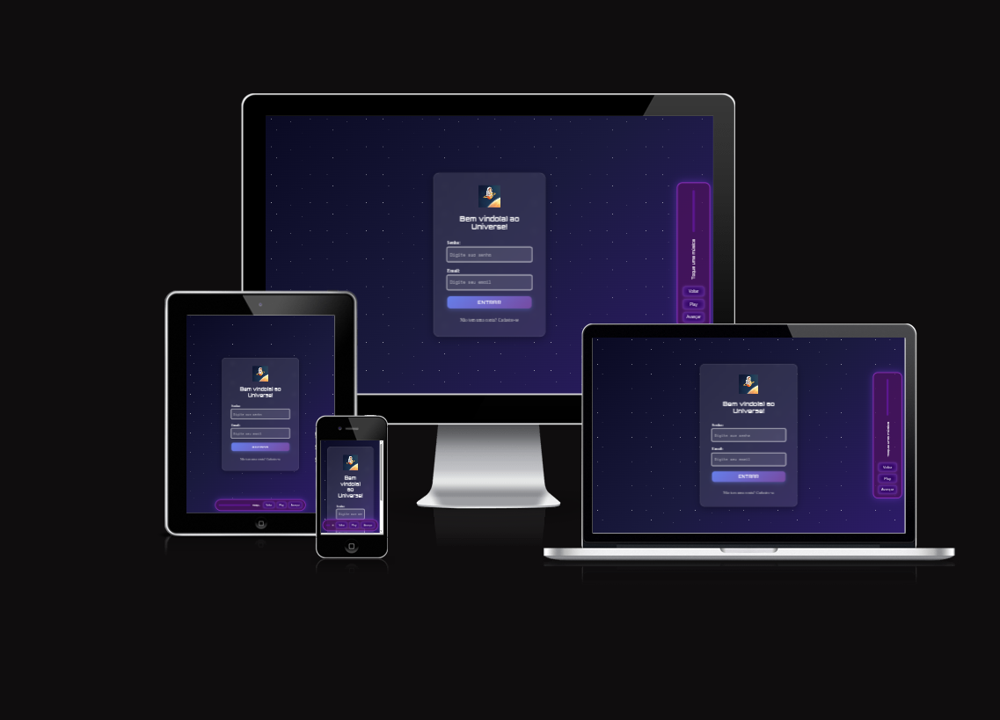

# 🚀 Projeto Universe  

💙 **“Explorar o desconhecido é o primeiro passo para criar algo incrível.”**

O **Universe** é um projeto que nasceu lá em 2022, como um protótipo escolar simples feito em HTML, CSS e PowerPoint para agrupar desenhos da tela. Inicialmente, o tema dele era focado totalmente em algo moderno + pegada infantil, até que neste ano (2025) decidi refazê-lo por conta própria, focando em mais funcionalidades e adotando um desing moderno.  
Hoje, ele evoluiu para um **site completo, interativo e moderno**, desenvolvido com **HTML, CSS e JavaScript puro e Node.js**, trazendo uma experiência única de exploração pelo espaço. 🌌  



---

## 🌠 Sobre o Projeto  

O **Universe** é uma **jornada digital pelo cosmos**, explorando constelações, planetas, galáxias e fenômenos astronômicos. Cada tela foi pensada para oferecer uma experiência visualmente imersiva e conectada à curiosidade de explorar o desconhecido.

O projeto conta com:  
- **Tela de Login e Cadastro**: com verificação de campos e sistema de criação de conta fictício (frontend).  
- **Tela Principal (Menu)**: acesso às opções “Explorar o Universo”, “Informações Astronômicas”, “Eventos Cósmicos” e muito mais.  
- **Sessões Interativas**: com informações sobre:
  - Constelações famosas (Órion, Cruzeiro do Sul, Andrômeda, etc.)  
  - Eventos astronômicos (Eclipses, Chuvas de Meteoros, Conjunções)  
  - Planetas do Sistema Solar, incluindo a Lua e o Sol ☀️🌙
- **Tela de Perfil do Usuário**: **Módulo de Edição completo com Galeria de Avatares**, onde é possível adicionar nome, foto, interesses e descrição (com gestão de estado de UI).
- **Tela de Criadores**: destacando o trabalho original de 2022 e a nova versão atualizada.  
- **Tela de Apagar Conta**: com mensagem personalizada e interação dinâmica.  
- **Trilha Sonora Espacial**: o usuário pode ouvir até 5 músicas-tema durante a navegação. 🎶  
- **Pesquisa Integrada com Múltiplas APIs da NASA:** sistema de busca robusto que combina resultados da API APOD e API Images.

---

## 💻 Backend Local e Arquitetura de APIs

O projeto agora possui **backend local em Node.js e Express** para consumir e proteger as chaves de API, seguindo as boas práticas de desenvolvimento.

### Arquitetura Robusta (APOD + Fallback)

O diferencial deste projeto é a arquitetura de **Resiliência e Agregação de Dados**:
1.  **Prioridade APOD (API com Chave):** Tenta buscar a Imagem/Vídeo do Dia.
2.  **Agregação:** Combina o resultado da APOD (se disponível) com a busca da API Images.
3.  **Sistema de Fallback:** Se a APOD falhar (por problemas de rede ou limite de requisições), o sistema **ignora a falha** e garante que os resultados da **API Images (gratuita)** ainda sejam exibidos, assegurando a experiência do usuário.

### Como rodar o backend na sua máquina

1. Clone o repositório:  
```bash
git clone https://github.com/Jaqueline-Gotardi/projeto-universe.git
```

2. Crie um arquivo .env na pasta /backend e adicione sua chave da NASA:
```bash
API_KEY=SUA_CHAVE_AQUI
```

3. Entre na pasta do backend:
```bash
cd projeto-universe/backend
```

4. Instale as dependências:
```bash
npm install
```

5. Rode o servidor local:
```bash
node server.js
```

6. O servidor vai iniciar em:
```http://localhost:3000```

OBS: Abra o *index.html* do frontend no navegador (Github Pages ou Live Server) para que ele se conecte ao servidor local.

---

## 🖌️ Melhorias Recentes

1. **Arquitetura de Backend (Node.js/Express):** Implementação de servidor local para consumo e proteção de chaves de API.

2. **Integração APOD + Images:** Sistema que agrega dados da Imagem do Dia (com tratamento para Imagem/Vídeo) e resultados da busca.

3. **Resiliência:** Lógica de fallback para garantir o funcionamento do Front-end mesmo com falha na API principal.

4. **Layout Dinâmico e Responsividade:** Quando a pesquisa é exibida, os elementos do Front-end (menu, barra) mudam o layout e a animação de fundo é ativada.
   
5. **Módulo de Perfil e UX**: Implementação completa do módulo de edição com Galeria de Avatares. Lógica de Gestão de Estado para os botões Salvar/Cancelar garantindo que a interface sempre resete para o último estado válido.

---

## 🧠 Aprendizados e Desafios  

Cada linha de código representa uma descoberta, e alguns erros de vírgula também! 😅  

Durante o desenvolvimento, aprimorei habilidades como:  
- Manipulação de DOM;
- Estruturação de formulários;
- Navegação dinâmica entre seções;  
- Lógica condicional com `if`;    
- Criação de telas conectadas por JavaScript;  
- Desenvolvimento Full Stack Júnior: Conexão entre Front-end (JavaScript) e Back-end (Node.js/Express).
- Tratamento de Erros: Implementação de try/catch e lógica de fallback para garantir a integridade da aplicação.
- Além disso, aprendi muito sobre **design de interface**, **consistência visual** e **experiência do usuário (UX)**, usando o **Lovart IA** para gerar imagens temáticas que reforçam o clima espacial. 🌠
- Gestão de Estado de UI: Lógica complexa de salvamento e reset de dados em formulários (Módulo de Perfil).

---

## 💭 Próximas Explorações (apenas idéias)  

Planejo incluir:  
- Integração com **banco de dados**; 
- Simulação **3D interativa**; 

Tudo isso mantendo o foco na experiência do usuário, e no aprendizado contínuo, 1% melhor por dia. 💙  

---

## 🛠️ Tecnologias Utilizadas  

- **HTML5**: Estrutura e semântica;
- **CSS3**: Estilo, animações e tema neon espacial; 
- **JavaScript (puro)**: Lógica, interatividade e controle das telas;  
- **Lovart IA**: Geração de imagens do universo;
- **Node.Js + Express**: Para Backend local;
---

## 🌌 Acesse o Projeto Aqui  

👉 **[Explorar o Universe aqui](https://jaqueline-gotardi.github.io/projeto-universe/)**  

---

## 💙 Créditos e Inspiração  

- Protótipo original criado no **Instituto Federal do Amazonas - Campus Eirunepé (IFAM)** -2022;
- Releitura e desenvolvimento atual por **Jaqueline Gotardi**; 

---

🕵️‍♀️ **Missão em andamento...**  
Mais descobertas estão a caminho. . .

---

**No Universo do código, cada erro é uma nova estrela sendo descoberta.** 💙
